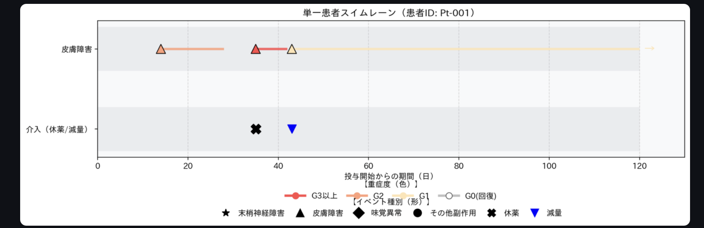
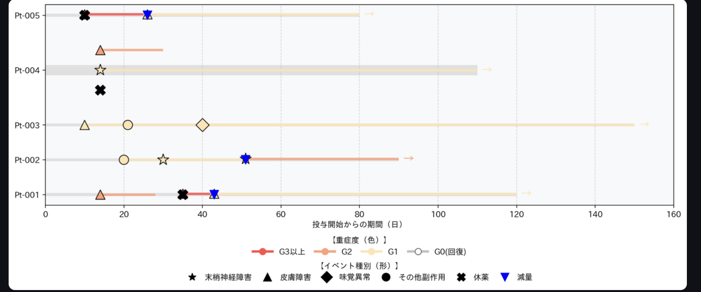

---

## 2) README_JA.md

```markdown
# Pad-Line
Pad-Lineは、抗がん剤治療における**副作用（AE）**と**介入（休薬・減量など）**を、患者ごとの時間軸上で統合して可視化する臨床ワークフロー支援ツールです。  
電子カルテ上で断片化しがちな情報を「患者×時間」で再構成し、カンファレンスや振り返りの認知負荷を下げることを目的としています。

**English README:** `README.md`

> **スコープ:** 可視化・ワークフロー支援  
> **診療推奨（判断の自動化）を行うツールではありません。**

---

## 背景
臨床現場では、副作用や介入の情報がテキスト記録や点情報として散在しやすく、以下が起こりがちです。

- 副作用が「いつ始まり、どれくらい続いたか」を追うのに時間がかかる  
- 休薬・減量・再開といった介入が、経過の中で埋もれる  
- 複数イベントが同日に重なり、全体像の把握に認知コストがかかる  

Pad-Lineはまず **N=1（目の前の患者）の経過把握**を支援します。  
入力が現場で回る形（過度に細かくしない最小セット）を優先し、同じ形式でデータが蓄積すれば、複数患者の比較（swimmer）や集計にも拡張可能です。

---

## 主な機能
- **swimmer / swimlane 切替**
  - *swimmer:* 複数患者を俯瞰（全体像）
  - *swimlane:* 単一患者をカテゴリ別レーンで詳細表示
- **副作用の期間表示**
  - 開始点 + 期間線（Gradeに応じて色分け）
- **介入イベント表示**
  - 休薬/減量などを点イベントとして表示
- **継続中イベント（→）**
  - 消失時期が未入力の場合、継続中として矢印表示
- **同日イベントの重なり回避**
  - 同日に複数イベントがあっても、上下に自動分散
- **見やすさスライダー**
  - 図の段数・間隔などの内部パラメータを隠蔽し、直感的に調整可能

---

## スクリーンショット
スクショは**合成データ（ダミー）**で作成してください（実患者データは使用しない）。

### swimlane（単一患者）


### swimmer（全体俯瞰）

---

## 実行方法
### 1) インストール
```bash
pip install -r requirements.txt
streamlit run app.py
